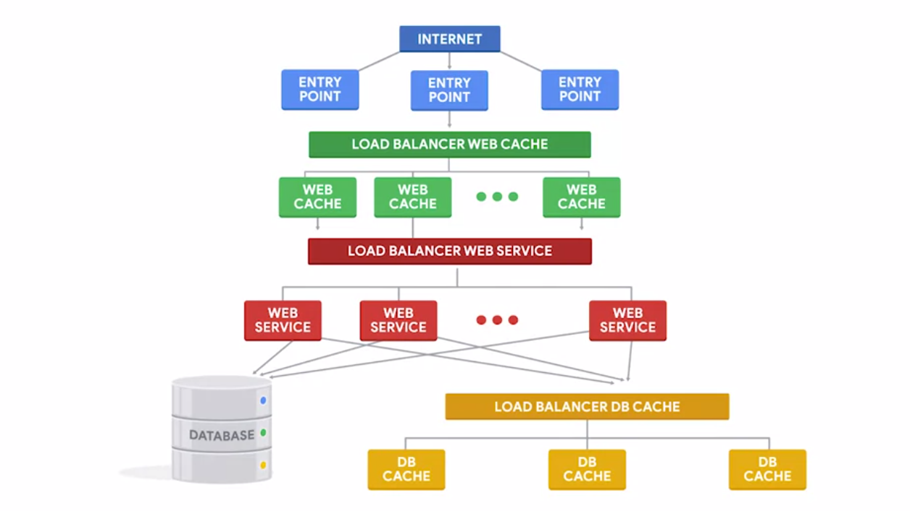
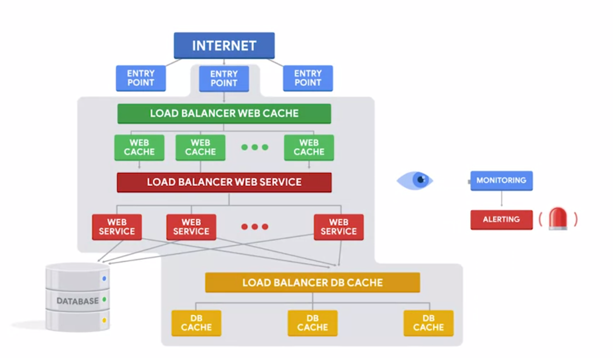

# Week 3: Automation in the Cloud

## Cloud Computing

---

## 3.1.1 Cloud Services Overview  

***Software as a Service (SaaS)***

> When a Cloud provider delivers an entire application or program to the customer.  

Examples of SaaS:  

1. Gmail
2. Dropbox
3. Microsoft Office 365

***Platform as a Service (PaaS)***

> When a Cloud provider offers a preconfigured platform to the customer.

Example of PaaS:  

1. SQL database as a service

***Infrastructure as a Service (IaaS)***

> When a Cloud provider supplies only the bare-bones computing experience.

Examples of IaaS:  

1. Amazon EC2
2. Google Compute Engine
3. Microsoft Azure Compute
4. Qwiklab

***Question***

If a bare-bones cloud computing experience is needed as well as a high level of control over the software being run, what Cloud service would one choose?  
`( )` Software as a Service  
`( )` SQL cloud services  
`( )` Platform as a Service  
`(✓)` Infrastructure as a Service (IaaS) *(Infrastructure as a Service (IaaS) provides users with the bare minimum needed to utilize a server’s computational resources, such as a virtual machine. It is the user's responsibility to configure everything else)*

## 3.1.2 Scaling in the Cloud  

***Capacity***

> How much the service can deliver.  

The way capacity of a system is measured, depends on what the system is doing.  

* Storing data -> total disk available  
* Web server responding to queries from external users -> queries per second (QPS) or total bandwidth served in an hour

***Horizontal scaling***

> Adding more nodes into the pool of a specific service.

***Vertical scaling***

> Making the resource size of a node bigger (memory, storage, CPU).

***Automatic scaling***

> The service offered by the Cloud provider will use metrics to automatically increase or decrease the capacity of the system

***Manual scaling***

> Changes are controlled by humans instead of software

***Question***

Which "direction" are we scaling when we add capacity to our network in order to meet demand?  
`( )` Down  
`( )` Horizontal  
`(✓)` Up *(Adding capacity to our network to meet demand—whether vertically or horizontally—is considered to be upscaling)*  
`( )` Vertical  

## 3.1.3 Evaluating the Cloud  

A few certifications of information security management:

* SOC 1
* ISO 27001

> We should always use reasonable judgement to protect the machines that we deploy, whether that's on physical servers running on-premise or on virtual machines in the Cloud.

Some specialized security procedures:

* Multi-factor authentication (MFA)
* Encrypted file systems
* Public-key cryptography

***Question***

What are some advantages to using cloud services?  
`[✓]` Offload complicated setups to the provider *(Cloud services provide many advantages, such as outsourcing support and maintenance, simplifying configuration management, and letting the provider take care of security)*  
`[✓]` Outsource troubleshooting and maintenance to the provider *(Cloud services provide many advantages, including simplifying configuration management, outsourcing support and maintenance, and letting the provider take care of security)*  
`[✓]` Letting the provider worry about complicated security measures *(Cloud services provide several advantages, like putting the provider in charge of security)*  
`[ ]` Avoiding bandwidth or connection issues  

## 3.1.4 Migrating to the Cloud  

Some popular managed web application platforms:

1. Amazon Elastic Beanstalk
2. Microsoft App Service
3. Google App Engine

***Containers***

> Applications that are packaged together with their configuration and dependencies.  

***Question***

What does the phrase ***lift and shift*** refer to?  
`(✓)` Migrating to the Cloud by virtualizing the current configuration *(When we migrate from traditional server configurations to the Cloud, we ***lift*** the current configuration and ***shift*** it to a virtual machine.)*  
`( )` Upscaling some nodes in the network while downscaling others  
`( )` Scaling horizontally  
`( )` Using a container  

A few cloud terminologies:

1. Public clouds
2. Private clouds
3. Hybrid clouds
4. Multi-clouds

***Public clouds***

> The cloud services provided to you by a third party

***Private clouds***

> When your company owns the services and the rest of your infrastructure, whether that's on-site or in a remote data center  

***Hybrid clouds***

> A mixture of both public and private clouds  

***Multi-clouds***

> A mixture of public and/or private clouds across vendors  

## 3.1.5 Quiz  

***Question 1***  

When we use cloud services provided to the general consumer, such as Google Suite or Gmail, what cloud deployment model are we using?  
`( )` Hybrid cloud  
`( )` Private cloud  
`(✓)` Public cloud *(A public cloud offers services to the general public, often as SaaS (Software as a Service) offerings)*  
`( )` Multi-cloud  

***Question 2***  

What is a container?  
`( )` A cloud deployment model that is a combination of public and private clouds  
`( )` A synonym for virtual machine  
`( )` A public file server  
`(✓)` A virtualized environment containing applications and configurations that can run quickly and reliably on any computing environment *(A container is an OS- and hardware-independent environment that allows for easy migration and compatibility)*  

***Question 3***  

Select the examples of Managed Web Application Platforms  
`[✓]` Google App Engine *(Google App Engine is a Platform as a Service (PaaS) product that offers access to Google's flexible hosting and Tier 1 Internet service for Web app developers and enterprises)*  
`[✓]` Amazon Elastic Beanstalk *(AWS Elastic Beanstalk is an easy-to-use PaaS service for deploying and scaling web applications)*  
`[✓]` Microsoft App Service *(Microsoft Azure App Service enables you to build and host web apps, mobile back ends, and RESTful APIs in the programming language of your choice without having to manage infrastructure)*  
`[ ]` Dropbox  

***Question 4***  

When a company solely owns and manages its own cloud infrastructure, what type of cloud deployment model are they using?  
`( )` Public cloud  
`( )` Hybrid cloud  
`(✓)` Private cloud *(A private cloud deployment is one that is fully owned and operated by a single company or entity)*  
`( )` Multi-cloud  

***Question 5***  

Which "direction" are we scaling when we add RAM or CPU resources to individual nodes?  
`( )` Down  
`( )` Horizontal  
`( )` Up  
`(✓)` Vertical *(Vertical scaling is a form of upscaling, but upscaling can also be horizontal)*  

## Managing Instances in the Cloud  

---

## 3.2.1 Spinning Up VMs in the Cloud  

***Reference images***

> Store the contents of a machine in a reusable format

***Templating***

> The process of capturing all of the system configuration to let us create VMs in a repeatable way

***Disk image***

> A snapshot of a virtual machine's disk at a given point in time

***Question***

If we want to reuse an exact copy of a virtual machine, we might save a snapshot to use as a reference image later. What is this snapshot called?  
`( )` An instance  
`( )` A boot disk  
`( )` A template  
`(✓)` A disk image *(A disk image is a snapshot of a virtual machine’s disk, and is an exact copy of the virtual machine at the time of the snapshot)*  

## 3.2.2 Creating a New VM Using the GCP Web UI  

***Question***

Using the web interface, what is an easy way to create a virtual machine identical to the one we've configured?  
`(✓)` Copy and reuse the command line *(By clicking the link labeled “Command line”, we can see the exact command used to create the virtual machine)*  
`( )` Save the settings as a text file  
`( )` Download the configuration as a manifest file  
`( )` Take a screenshot of the settings screen  

Unix-based command to check system OS  

```shell
cat /etc/lsb-release
```

Command to check current weather  

```shell
curl wttr.in
```

## 3.2.3 Customizing VMs in GCP  

To make sure a script can be executed as service, it should be located at

```shell
/usr/local/bin/{script_name}
```

and the service file should be located/ copied to

```shell
/etc/systemd/system/{service_name.service}
```

To enable the service after system reboot, use the following command  

```shell
sudo systemctl enable {service_name}
```

***Question***

It’s important to know where to copy our systemd service file on Linux in order to configure our scripts as services. Do you remember the location of the systemd directory?  
`( )` `/user/bin`  
`( )` `/root`  
`( )` `/home`  
`(✓)` `/etc/systemd/system` *(`etc/systemd/system/` is the default systemd directory in many Linux distros, including Red Hat Linux.)*  

The following command can be used to check any running services

```shell
ps ax | grep {service_name}
```

## 3.2.4 Templating a Customized VM  

It would be easier to perform batch action using command line interface.  

Command to interact with Google Cloud CLI, assuming the `gcloud` feature has been installed.  

1. Initialization and authentication

    ```shell
    gcloud init
    ```

2. Choose desired project name
3. Select default region and zone

Example command to create 5 instances simultaneously through CLI

```shell
gcloud compute instances create --source-instance-template webserver-template ws1 ws2 ws3 ws4 ws5 
```

***What it does?***

* `compute` parameter to access `compute engine` service
* Create instances using parameter `instances create` from template named `webserver-template`
* The names of the 5 instances are `ws1`, `ws2`, `ws3`, `ws4`, and `ws5` respectively.

***Question***  

What does the `gcloud init` command do?  
`( )` Displays Google Cloud connection data  
`( )` Creates a new virtual machine  
`(✓)` Authenticates the connection between our virtual machine and Google Cloud  
`( )` Initializes configuration tests  

## 3.2.5 Managing VMs in GCP  

[Quickstart using a Linux VM](https://cloud.google.com/compute/docs/quickstart-linux)  
[Creating a VM Instance from an Instance Template](https://cloud.google.com/compute/docs/instances/create-vm-from-instance-template)  
[Google Cloud SDK Documentation](https://cloud.google.com/sdk/docs)  

## 3.2.6 Quiz  

***Question 1***  

What is templating?  
`(✓)` The process of capturing the entire system configuration to enable us to reproduce virtual machines *(Effective templating software allows you to capture an entire virtual machine configuration and use it to create new ones)*  
`( )` The process of copying virtual machines  
`( )` The process of creating a new virtual machine instance  
`( )` The process of testing configurations against known-working settings  

***Question 2***  

Why is it important to consider the region and zone for your cloud service?  
`( )` To follow local laws and regulations  
`( )` To avoid time zone discrepancy  
`( )` To avoid language barriers  
`(✓)` To ensure bandwidth and reliability for users *(Generally, you're going to want to choose a region that is close to your users so that you can deliver better performance)*  

***Question 3***  

What option is used to determine which OS will run on the VM?  
`( )` Machine type  
`(✓)` Boot disk *(The boot disk from which the VM boots will determine what operating system runs on the VM)*  
`( )` Region  
`( )` Template  

***Question 4***  

When setting up a new series of VMs using a reference image, what are some possible options for upgrading services running on our VM at scale?  
`[ ]` Manually updating files via the command line  
`[✓]` Create a new reference image each update *(One way of updating VM services at scale is to simply spin them up again with an updated reference image)*  
`[ ]` Editing parameters and uploading files individually through the web interface  
`[✓]` Use a configuration management system like Puppet *(Puppet or other configuration management systems provide a streamlined way to deploy service updates at scale)*  

***Question 5***

When using gcloud to manage VMs, what two parameters tell gcloud that a) we want to manage our VM resources and b) that we want to deal with individual VMs? (Check two)  
`[✓]` `compute` *(The `compute` parameter tells gcloud that we are managing Compute Engine resources)*  
`[ ]` `init`  
`[✓]` `instances` *(The `instances` parameter that follows the `compute` parameter tells gcloud that we want to manage our VMs on the instance level)*  
`[ ]` `create`  

## Automating Cloud Deployment  

---

## 3.3.1 Cloud Scale Deployments  

***Load balancer***

> Ensures that each node receives a balanced number of requests

***Round robin***

> Giving each node one request

***Autoscaling***  

> Allows the service to increase or reduce capacity as needed, while the service owner only pays for the cost of the machines that are in use at any given time  

Some popular caching applications  

1. Varnish
2. Nginx

A few providers that do ***web caching as a service***

1. Cloudflare
2. Fastly

Typical cloud services used by a web application  



Most popular database caching services

1. Memcached
2. Redis

***Question***  

What does a load balancer do?  
`( )` Removes inactive nodes  
`( )` Provides extra bandwidth  
`( )` Enhances security  
`(✓)` Ensures each node receives a reasonable number of requests *(Load balancers reroute requests in order to balance and reduce network load)*  

## 3.3.2 What is Orchestration?  

***Automation***  

> The process of replacing a manual step with one that happens automatically  

A few ways to automate the creation of Cloud instances  

1. Use templating to create new virtual machines
2. Run a command line tool that automatically creates new instances
3. Enable autoscaling

***Orchestration***  

> The automated configuration and coordination of complex IT systems and services  

Orchestration tools typically don't communicate with the Cloud systems through web interface or the command line. Instead, they normally use an Application Programming Interface (API) to interact with the Cloud infrastructure directly from the scripts.  

***Hybrid cloud***  

> Only part of the services are in the cloud  

Nowadays, it is very common to have a hybrid cloud setup, where a few services are located on-premise and a few are located in the cloud. To ensure both can communicate smoothly, ***monitoring*** and ***alerting*** services are typically required.  

  


***Question***  

What is the difference between automation and orchestration?  
`( )` Orchestration refers to a single task; automation arranges tasks to optimize a workflow  
`(✓)` Automation refers to a single task; orchestration arranges tasks to optimize a workflow *(Automation is when we set up a single step in a process to require no oversight, while orchestration refers to automating the entire process)*  
`( )` Automation is automatic; orchestration is entirely manual  
`( )` Automation is entirely automated; orchestration requires manual oversight  

## 3.3.3 Cloud Infrastructure as Code  

A few tools for managing resources as code  

1. Amazon Cloud Formation  
2. Google Cloud Deployment Manager  
3. Microsoft Azure Resource Manager  
4. OpenStack Heat Orchestration Templates  

An option that is becoming really popular in the orchestration field is called ***Terraform***.  

Similar to ***Puppet***, ***Terraform*** uses its specific Domain-specific language (DSL).

***Question***  

Do you remember what Infrastructure as Code (IaC) is?  
`(✓)` Using machine readable files to automate configuration *(IaC uses special machine-readable config files to automate configuration management)*  
`( )` A template for a software program that hasn't been written yet  
`( )` A programming language  
`( )` Code that accesses an external API  

## 3.3.4 More about Cloud & GCP  

[Getting started with Terraform on Google Cloud](https://cloud.google.com/community/tutorials/getting-started-on-gcp-with-terraform)  
[Creating Groups of Unmanaged Instances](https://cloud.google.com/compute/docs/instance-groups/creating-groups-of-unmanaged-instances)  
[External HTTP(S) Load Balancing Overview](https://cloud.google.com/load-balancing/docs/https/)  
[How to Create a Load Balancer on Google Cloud?](https://geekflare.com/gcp-load-balancer/)  
[Create a CentOS 7 Terraform Template for VMware vSphere](https://blog.inkubate.io/create-a-centos-7-terraform-template-for-vmware-vsphere/)  
[Terraform Enterprise GCP Reference Architecture](https://www.terraform.io/docs/enterprise/before-installing/reference-architecture/gcp.html)  
[Terraform for On-Premises and Hybrid Cloud at Wayfair](https://www.hashicorp.com/resources/terraform-on-premises-hybrid-cloud-wayfair)  

## 3.3.5 Quiz  

***Question 1***  

In order to detect and correct errors before end users are affected, what technique(s) should we set up?  
`(✓)` Monitoring and alerting *(Monitoring and alerting allows us to monitor and correct incidents or failures before they reach the end user)*  
`( )` Orchestration  
`( )` Autoscaling  
`( )` Infrastructure as Code  

***Question 2***  

When accessing a website, your web browser retrieves the IP address of a specific node in order to load the site. What is this node called?  
`( )` Gate node  
`(✓)` Entry point *(When you connect to a website via the Internet, the web browser first receives an IP address. This IP address identifies a particular computer: the entry point of the website)*  
`( )` Access machine  
`( )` Front line  

***Question 3***  

What simple load-balancing technique just assigns to each node one request at a time?  
`( )` Random  
`(✓)` Round Robin *(Round-robin load balancing is a basic way of spreading client requests across a server group. In turn, a client request will be forwarded to each server. The load balancer is directed by the algorithm to go back to the top of the list and repeat again)*  
`( )` Least connections  
`( )` Source IP  

***Question 4***  

Which cloud automation technique spins up more VMs into instance groups when demand increases, and shuts down VMs when demand decreases?  
`( )` Infrastructure as Code  
`(✓)` Autoscaling *(Autoscaling helps us save costs by matching resources with demand automatically)*  
`( )` Load Balancing  
`( )` Orchestration  

***Question 5***  

Which of the following are examples of orchestration tools used to manage cloud resources as code? (Check all that apply)  
`[✓]` Terraform *(Like Puppet, Terraform uses its own domain specific language (DSL), and manages configuration resources as code)*  
`[✓]` CloudFormation *(CloudFormation is a service provided by Amazon to assist in modeling and managing AWS resources)*  
`[✓]` Azure Resource Manager *(Azure Resource Manager is the deployment and management service for Azure. It provides a management layer that enables you to create, update, and delete resources)*  
`[ ]` CloudFlare  
